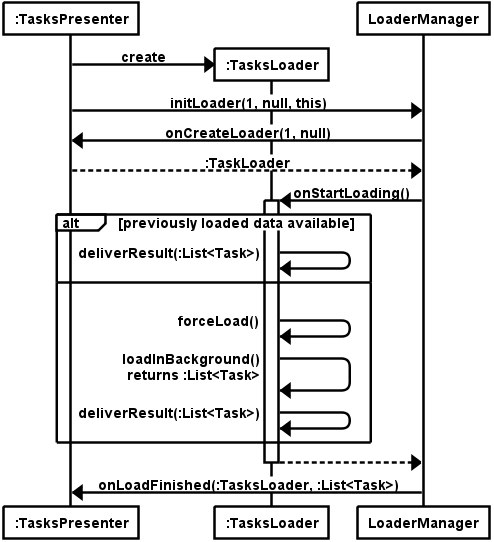
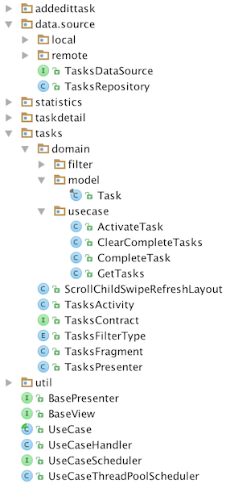
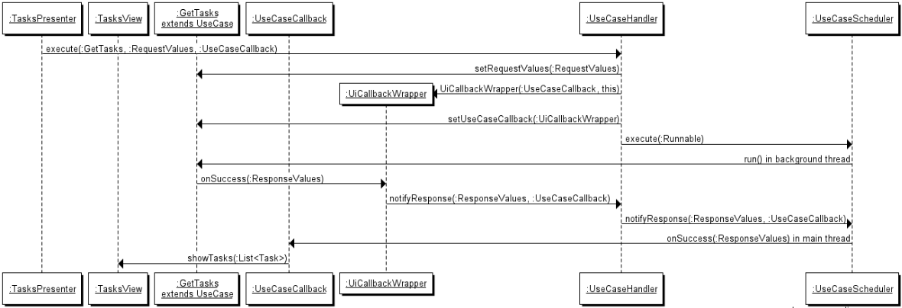

# Android Architecture Blueprints

https://github.com/googlesamples/android-architecture

- 안드로이드 프레임워크는 자유도가 높기 때문에 잘못된 아키텍처를 설계하기 쉽다.
- [The TODO app](https://github.com/googlesamples/android-architecture/wiki/To-do-app-specification)을 여러가지 다른 아키텍처로 구현한 예를 제시한다.
  - MVP
  - MVP + Loaders
  - MVP + DataBinding
  - MVP + Clean Architecture
  - MVP + Dagger2
  - MVP + ContentProviders
- [Samples at a glance](https://github.com/googlesamples/android-architecture/wiki/Samples-at-a-glance)

## MVP

https://github.com/googlesamples/android-architecture/tree/todo-mvp/


- Model-View-Presenter pattern with no architectural frameworks
- App은 4개의 feature(Tasks, TaskDetail, AddEditTask, Statistics)로 구성
- 각 feature는 4개의 module로 구성
  - Contract: view와 presenter의 connection 정의
  - Activity: views, presenters 생성
  - Fragment: view interface 구현 (no business logic)
  - Presenter: presenter interface 구현 (business logic)

### Code

Activity에서 Presenter의 생성자에 Fragment 인스턴스 전달.

```java
mTasksPresenter = new TasksPresenter(
    Injection.provideTasksRepository(getApplicationContext()), tasksFragment);
```

Presenter의 생성자에서 View에 Presenter 인스턴스 전달

```java
public TasksPresenter(@NonNull TasksRepository tasksRepository, @NonNull TasksContract.View tasksView) {
    ...
    mTasksView.setPresenter(this);
}
```

Fragment에서 Presenter의 `start()` 호출

```java
@Override
public void onResume() {
    super.onResume();
    mPresenter.start();
}
```

Fragment는 이벤트 발생하면 Presenter의 메서드 호출

```java
fab.setOnClickListener(new View.OnClickListener() {
    @Override
    public void onClick(View v) {
        mPresenter.addNewTask();
    }
});
```

Fragment에 의해 호출된 Presenter의 메서드는 business logic 수행 후 Fragment 메서드 호출

```java
@Override
public void completeTask(@NonNull Task completedTask) {
    checkNotNull(completedTask, "completedTask cannot be null!");
    mTasksRepository.completeTask(completedTask);
    mTasksView.showTaskMarkedComplete();
    loadTasks(false, false);
}
```

다른 화면으로 이동하는 경우 Fragment에서 `startActivty()` 호출

```java
@Override
public void showAddTask() {
    Intent intent = new Intent(getContext(), AddEditTaskActivity.class);
    startActivityForResult(intent, AddEditTaskActivity.REQUEST_ADD_TASK);
}
```

## MVP + Loaders

https://github.com/googlesamples/android-architecture/tree/todo-mvp-loaders/


- Task Repository에서 데이터를 가져올 때, [Loader](https://developer.android.com/guide/components/loaders.html)를 사용
- Loader의 장점
  - 데이터의 비동기식 로딩을 제공합니다.
  - **데이터의 출처를 모니터링하여 그 콘텐츠가 변경되면 새 결과를 전달합니다.**
  - 구성 변경 후에 재생성된 경우, 마지막 로더의 커서로 자동으로 다시 연결됩니다. 따라서 데이터를 다시 쿼리하지 않아도 됩니다.
- Presenter는 TaskRepository에서 직접 task 데이터를 조회하는 대신 TaskLoader를 사용
- TaskLoader는 TaskRepository에 요청하여 데이터를 가져와 client에 전달
- Android Loader framework가 정의한 lifecycle을 따라서 초기 데이터를 가져오고 변경 사항을 반영하는 과정을 구현.
- 비동기로 데이터를 가져오는 과정을 안드로이드가 쓰레드 관리 포함하여 효율적으로 처리한다.

### Understandability

Loaders framework에 익숙해야 함 (not trivial)

### Testability

Loaders framework를 사용함으로써 Android framework에 big dependency 생겨 unit testing이 더 어려움

### Code



Presenter에서 loader 초기화 요청. 마지막 인자 this는 `LoaderManager.LoaderCallbacks<List<Task>>` 인터페이스를 구현한 Presenter 자신.

```java
@Override
public void start() {
    mLoaderManager.initLoader(TASKS_QUERY, null, this);
}
```

`initLoader`에 의해서 `onCreateLoader()`가 호출되며 여기서 시작하길 원하는 loader 인스턴스 반환.

```java
@Override
public Loader<List<Task>> onCreateLoader(int id, Bundle args) {
    mTasksView.setLoadingIndicator(true);
    return mLoader;
}
```

Loader에 의해 데이터 로딩이 끝나면, `onLoadFinished()` 메서드가 UI 쓰레드에서 호출된다.

```java
@Override
public void onLoadFinished(Loader<List<Task>> loader, List<Task> data) {
    mTasksView.setLoadingIndicator(false);

    mCurrentTasks = data;
    if (mCurrentTasks == null) {
        mTasksView.showLoadingTasksError();
    } else {
        showFilteredTasks();
    }
}
```

TaskLoader는 `AsyncTaskLoader<List<Task>>`를 상속하고, `loadInBackground()`를 구현함으로써 worker thread에서 data를 가져오도록 한다.

```java
@Override
public List<Task> loadInBackground() {
    return mRepository.getTasks();
}
```

이 메서드가 반환한 데이터는 `deliverResult()`로 전달되며 callback을 통해 최종적으로 client에 전달된다.

## MVP + DataBinding

https://github.com/googlesamples/android-architecture/tree/todo-databinding/


- Android가 제공하는 [Data Binding Library](https://developer.android.com/topic/libraries/data-binding)를 활용
- Layout XML 파일에 데이터, 이벤트 핸들러 바인딩을 정의

### Testability

#### Unit Testing

- Data Binding Library는 unit test된 많은 관계를 다룬다.
- 우리가 추가할 unit test의 수는 적지만 전체적으로 coverage는 비슷하다.

### Code metrics

- 클래스의 수 증가
- Wiring code가 XML로 옮겨가면서 레이아웃 XML 라인 수 증가. Java 라인 수 감수.

### Maintainability

- 기존 feature 범위 내에서 작은 수정 사항은 적용하기 쉬움
- 새로운 feature를 추가하려면 Data Binding Library를 사용 경험 필요
- Data Binding Library에 의한 component간 communication을 이해해야 함

### Code

build.gradle에서 Data Binding 라이브러리 사용 선언

```
android {
    dataBinding {
        enabled = true
    }
}
```

tasks_frag.xml 레이아웃 XML 파일에 데이터 바인딩에 사용할 변수 정의 및 참조

```xml
<layout xmlns:android="http://schemas.android.com/apk/res/android">
    <data>
        <import type="android.view.View" />
        <variable
            name="tasks"
            type="com.example.android.architecture.blueprints.todoapp.tasks.TasksViewModel" />
        <variable
            name="actionHandler"
            type="com.example.android.architecture.blueprints.todoapp.tasks.TasksContract.Presenter" />
    </data>

    <TextView
        `android:id="@+id/noTasksAdd"
        android:layout_width="wrap_content"
        android:layout_height="48dp"
        android:layout_gravity="center"
        android:background="@drawable/touch_feedback"
        android:gravity="center"
        android:text="@string/no_tasks_add"
        android:onClick="@{() -> actionHandler.addNewTask()}"
        android:visibility="@{tasks.tasksAddViewVisible ? View.VISIBLE : View.GONE}" />
```

Data binding을 사용한 tasks_frag.xml로부터 `TasksFragBinding` 클래스가 자동 생성 된다. `TasksFragment`는 `onCreateView()`에서 `TasksFragBinding.inflate()`를 호출하여 UI를 초기화 한다. 그리고 XML에서 정의한 변수에 해당하는 객체를 `TasksFragBinding`에 전달한다.

```java
@Nullable
@Override
public View onCreateView(LayoutInflater inflater, ViewGroup container,
                         Bundle savedInstanceState) {
    TasksFragBinding tasksFragBinding = TasksFragBinding.inflate(inflater, container, false);
    tasksFragBinding.setTasks(mTasksViewModel);
    tasksFragBinding.setActionHandler(mPresenter);
```

Data binding에 사용한 객체는 public으로 property를 공개하거나 또는 getProperty 메서드를 제공해야 한다. `TasksViewModel` 클래스는 아래와 같이 레이아웃에서 참조하는 property인 `tasksAddViewVisible`의 값을 반환하는 메서드를 제공한다.

```java
@Bindable
public boolean getTasksAddViewVisible() {
    return mPresenter.getFiltering() == ALL_TASKS;
}
```

Property 값이 변경되어 UI가 업데이트 되어야 할 필요가 있을 때는 아래와 같이 `notifyPropertyChanged(int fieldId)`를 호출해야 한다.

```java
public void setTaskListSize(int taskListSize) {
    mTaskListSize = taskListSize;
    notifyPropertyChanged(BR.noTaskIconRes);
    notifyPropertyChanged(BR.noTasksLabel);
    notifyPropertyChanged(BR.currentFilteringLabel);
    notifyPropertyChanged(BR.notEmpty);
    notifyPropertyChanged(BR.tasksAddViewVisible);
}
```

## MVP + Clean Architecture

https://github.com/googlesamples/android-architecture/tree/todo-mvp-clean/


- MVP sample을 기반으로 repository와 presentation layer 사이에 domain layer를 추가하여 Clean Architecture를 구현
- Domain layer는 모든 비지니스 로직을 구현. Use Case는 모든 가능한 operation을 표현하며 presentation layer에 의해 사용된다.
- 비지니스 로직을 presenter에서 domain layer로 가져와 비슷한 일을 하는 여러 presenter에 중복된 코드를 제거
- Use Case는 앱이 필요로 하는 모든 operation을 정의하고 있으며 이름이 목적을 명확히 하므로 코드의 readability가 향상
- Use Case의 실행은 백그라운드 쓰레드에서 command pattern에 의해 이루어진다.
- Domain layer는 완전히 Android SDK, 3rd party 라이브러리와 분리되어 있다.

### Issues and Notes

- Use case는 쓰레드 풀에서 실행되도록 되어 있는데, RxJava 또는 Promises를 사용하여 구현할 수도 있다.
- View, domain layer에서 다른 model을 사용할 것을 추천한다. View model이 Android 관련 필드를 갖는 경우 2개의 model을 사용하고 상호 변환하는 mapper 클래스를 제공해야 한다.
- 실제 앱에서 `onError` 콜백은 문제의 원인을 나타낼 수 있어야 한다.

### Testability

- 모든 domain 코드는 unit test를 작성할 수 있다.
- Use case에서부터 view, repository까지 포함한 integration test로 확장할 수 있다.

### Maintainability

- 구조상 feature를 수정하거나 추가하기 쉽고
- Verbose 하기 때문에 코드를 이해하기도 매우 쉽다.

### Packages & Classes



### Code



`UseCase<Q, P>` 추상 클래스는 입력값 설정, 실행, 결과 콜백 관련 타입, 인터페이스, 메서드를 정의한다.

`UseCaseHandler`는 `UseCase`를 실행해주는 `execute(useCase, values, callback)` 메서드를 제공한다. `UseCase`를 실행할 때 생성자로 전달 받은 `UseCaseScheduler`를 이용한다.

```java
public <T extends UseCase.RequestValues, R extends UseCase.ResponseValue> void execute(
        final UseCase<T, R> useCase, T values, UseCase.UseCaseCallback<R> callback) {
    useCase.setRequestValues(values);
    useCase.setUseCaseCallback(new UiCallbackWrapper(callback, this));

    mUseCaseScheduler.execute(new Runnable() {
        @Override
        public void run() {
            useCase.run();
        }
    });
}
```

콜백인스턴스를 설정할 때, `UiCallbackWrapper`로 감싸서 콜백 메서드가 호출되었을 때, `UseCaseHandler`가 제공하는 `notifyResponse()`를 호출하게 한다.

```java
public <V extends UseCase.ResponseValue> void notifyResponse(final V response,
                                                             final UseCase.UseCaseCallback<V> useCaseCallback) {
    mUseCaseScheduler.notifyResponse(response, useCaseCallback);
}
```

`UseCaseHandler`는 `UseCaseThreadPoolScheduler`를 사용하는데, `execute()`는 백그라운드 쓰레드에서, `notifyResponse()`는 메인쓰레드에서 호출하도록 구현되어 있다.

```java
public class UseCaseThreadPoolScheduler implements UseCaseScheduler {
    private final Handler mHandler = new Handler();
    public static final int POOL_SIZE = 2;
    public static final int MAX_POOL_SIZE = 4;
    public static final int TIMEOUT = 30;
    ThreadPoolExecutor mThreadPoolExecutor;

    public UseCaseThreadPoolScheduler() {
        mThreadPoolExecutor = new ThreadPoolExecutor(POOL_SIZE, MAX_POOL_SIZE, TIMEOUT,
                TimeUnit.SECONDS, new ArrayBlockingQueue<Runnable>(POOL_SIZE));
    }

    @Override
    public void execute(Runnable runnable) {
        mThreadPoolExecutor.execute(runnable);
    }

    @Override
    public <V extends UseCase.ResponseValue> void notifyResponse(final V response,
            final UseCase.UseCaseCallback<V> useCaseCallback) {
        mHandler.post(new Runnable() {
            @Override
            public void run() {
                useCaseCallback.onSuccess(response);
            }
        });
    }

    @Override
    public <V extends UseCase.ResponseValue> void onError(
            final UseCase.UseCaseCallback<V> useCaseCallback) {
        mHandler.post(new Runnable() {
            @Override
            public void run() {
                useCaseCallback.onError();
            }
        });
    }
}
```

`TasksActivity`에서 `TasksPresenter`를 생성할 때 Presenter에서 사용할 모든 `UseCase` 객체들을 전달한다.

```java
mTasksPresenter = new TasksPresenter(
        Injection.provideUseCaseHandler(),
        tasksFragment,
        Injection.provideGetTasks(getApplicationContext()),
        Injection.provideCompleteTasks(getApplicationContext()),
        Injection.provideActivateTask(getApplicationContext()),
        Injection.provideClearCompleteTasks(getApplicationContext())
        );
```

`Injection` 클래스에서 `UseCase` 객체를 생성할 때 Repository 객체를 생성자로 전달한다.

```java
public static GetTasks provideGetTasks(@NonNull Context context) {
    return new GetTasks(provideTasksRepository(context), new FilterFactory());
}
```

`TasksPresenter`는 비지니스 로직 수행이 필요한 경우 `UseCaseHandler`를 통해 생성자에서 전달받은 `UseCase` 실행을 요청한다. 콜백을 통해 결과를 받으면 View를 통해 UI를 업데이트 한다.

```java
GetTasks.RequestValues requestValue = new GetTasks.RequestValues(forceUpdate,
        mCurrentFiltering);

mUseCaseHandler.execute(mGetTasks, requestValue,
        new UseCase.UseCaseCallback<GetTasks.ResponseValue>() {
            @Override
            public void onSuccess(GetTasks.ResponseValue response) {
                List<Task> tasks = response.getTasks();
                // The view may not be able to handle UI updates anymore
                if (!mTasksView.isActive()) {
                    return;
                }
                if (showLoadingUI) {
                    mTasksView.setLoadingIndicator(false);
                }

                processTasks(tasks);
            }

            @Override
            public void onError() {
                // The view may not be able to handle UI updates anymore
                if (!mTasksView.isActive()) {
                    return;
                }
                mTasksView.showLoadingTasksError();
            }
        });
```

### My Review

- Feature 별로 package를 구성하다보니 presentation layer와 domain layer가 같은 package 아래에 있다. 좋은 방법인가?
- Domain layer를 별도의 프로젝트로 구성하면 더 좋을 것 같다.
- Domain layer에서 사용하는 repository interface는 domain layer package에서 정의해야 할 것 같은데 그렇지 않다.
- Request-Response Use Case만 구현하였는데, Publish-Subscribe와 같이 다른 커뮤니케이션 타입을 지원하는 Use Case도 필요할 것 같다.

### References

- [Clean Architecture](https://8thlight.com/blog/uncle-bob/2012/08/13/the-clean-architecture.html)
- [android10/Android-CleanArchitecture](https://github.com/android10/Android-CleanArchitecture)

## MVP + Dagger2

## MVP + ContentProviders
