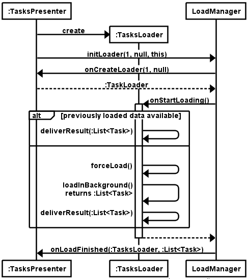

# Android Loader

## State Machine

## Google's Overview

로더는 Android 3.0부터 도입된 것으로, 액티비티 또는 프래그먼트에서 비동기식으로 데이터를 쉽게 로딩할 수 있게 합니다. 로더의 특성은 다음과 같습니다.

  - 모든 Activity와 Fragment에 사용할 수 있습니다.
  - 데이터의 비동기식 로딩을 제공합니다.
  - 데이터의 출처를 모니터링하여 그 콘텐츠가 변경되면 새 결과를 전달합니다.
  - 구성 변경 후에 재생성된 경우, 마지막 로더의 커서로 자동으로 다시 연결됩니다. 따라서 데이터를 다시 쿼리하지 않아도 됩니다.

## My Overview

- 데이터베이스 또는 네트워크에서 데이터를 비동기로 가져오는 과정을 제대로 구현하기 어렵기 때문에 구글에서 프레임워크 제공
- 비동기로 데이터를 가져오는 작업을 위한 쓰레드 관리, 결과는 Main Thread로 전달
- 로딩 중 취소 등 비동기 로딩에 필요한 연산 제공
- Activity, Fragment의 lifecycle에 맞춰 데이터 동기화 작업 수행

## API Overview

## API Details

- 액티비티 또는 프래그먼트당 LoaderManager는 하나
- Loader, AsyncTaskLoader, CursorLoader 중 하나를 구현하여 LoaderManager를 통해 활용
- LoaderManager.initLoader(id, args, callback)를 통해 Loader 요청
  - 해당 id의 Loader가 이미 생성되어 있다면 다시 생성하지 않음
  - Loader를 처음 생성해야 하는 경우 LoaderCallbacks.onCreateLoader(id, args)가 호출되어 여기서 로더 객체를 생성해서 반환해야 함
  - Loader에서 데이터 로딩이 끝나면 LoaderCallbacks.onLoadFinished(loader, data)가 호출되어 데이터가 UI로 전달됨

## Reference

- https://developer.android.com/guide/components/loaders.html
