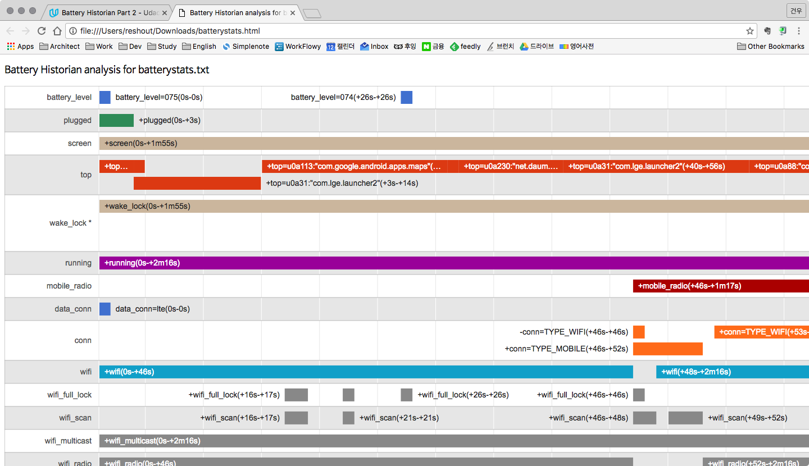
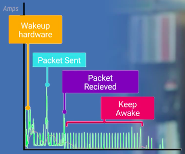

# Udacity - Android Performance

https://www.udacity.com/course/android-performance--ud825

## Lesson 1: Render

### Overdraw를 줄이자

- 다른 화면에 가려서 보이지 않는 영역을 그리는 일이 없도록
- 불필요하게 같은 영역을 여러번 그리는 일이 없도록
- 불필요한 배경을 그리는 일이 없도록
- Custom View를 작성하는 경우 [clipRect()](https://goo.gl/eSebwI) 메서드를 활용해 화면에 그려질 필요가 있는 영역을 표시
- Tool: Settings > Developer options > Debug GPU overdraw

### 중첩 Layout을 피하자

- 그려질 내용이 바뀔 때마다 DisplayList를 다시 생성하고 실행해 화면에 그려야 한다.
- 계층 구조가 깊고 복잡할 수록 측정-레이아웃 단계에서 성능 문제 발생
- 레이아웃을 단순하고 평면적으로 구성할 수록 렌더링 성능에 유리함
- LinearLayout 보다 RelativeLayout을 활용하기
- Tool: Hierarchy Viewer를 통해 뷰의 계층 구조를 파악하고 각 노드의 상대적 렌더링 성능 확인할 수 있음

## Lesson 2A: Compute

### 성능 문제 2종류

1. 느린 함수
1. 느린 코드가 여기저기 흩어져 있는 경우 → Trace View로 profiling

### Batching and Caching

모든 성능 향상 방법은 사실상 batching과 caching을 변경한 것 뿐  

#### Batching

- 실행할 때마다 걸리는 오버헤드 줄이기
- 데이터를 준비하는 단계에서 수행
- `Set.contains()`: 한 번만 정렬하고 그 결과를 저장한 후 원소 찾기

#### Caching

- 여러 번 반복하는 계산의 결과값이 매번 같을 때 저장 후 참조

### Blocking the UI Thread

- 함수의 성능만큼 함수가 어디서 실행되는지도 중요
- UI callback이 16ms안에 return하지 못하면 렌더링 프레임을 놓쳐 렉 발생
- UI thread의 렌더링 작업이 5초 이상 이상 멈추면 ANR 발생
- **그림을 그리는데 필수적이지 않은 작업은 독립적인 쓰레드로 옮기기**
  - [AsyncTask](https://developer.android.com/reference/android/os/AsyncTask.html)

### Container Performance

- 프로그래밍 언어가 제공하는 컨테이너에서 성능 문제가 발생하는 경우가 많음
- 컨테이너를 사용하는 방식에 따라 성능이 다름
- 가장 효율적인 컨테이너를 사용하고 있는가?

### Tool: Traceview


- 2가지 프로파일링 방법 중 하나 선택
  1. 샘플링 주기(default: 1000 microseconds)마다 프로파일링
  1. 모든 메서드의 시작과 종료를 기록 (자원 많이 사용)
- 상단엔 타임라인 패널
  - 시간 흐름에 따른 쓰레드별 코드 진행
  - 메서드마다 다른 색
  - U 모양 막대로 메서드 시작과 끝 표현
- 하단엔 프로파일 패널
  - 특정 메서드가 사용한 독점, 포괄적(호출한 메서드 수행 시간 포함) CPU 시간
  - 메서드 호출 횟수, 메서드 재귀 호출 횟수

### Tool: Systrace


- What it's good for:
  - **Evaluating container performance**
  - Finding performance bottlenecks in the execution of your code
- The Systrace tool helps analyze the performance of your application by capturing and displaying execution times of your applications processes and other Android system processes.
- References
  - [Analyzing UI Performance with Systrace](https://developer.android.com/studio/profile/systrace.html)
  - [Systrace Walkthrough](https://developer.android.com/studio/profile/systrace-walkthru.html)

## Lesson 2B: Memory

### Memory, GC, and Performance

- 메모리 누수: 사용하고 반납되지 않은 메모리 조각
- 안드로이드에선 GC가 더 이상 필요하지 않은 메모리를 시스템으로 반납
- GC를 언제 어떻게 수행할지는 어려운 문제
- GC 수행 방식은 안드로이드 런타임 버전에 따라 다름
  - Dalvik의 GC 이벤트는 stop-the-world
- 하나의 긴 GC, 연속적인 GC로 인해 프레임 처리 속도가 16ms를 넘어갈 수 있음
- Java에서도 GC에 의해 회수되지 않는 메모리 누수 발생할 수 있음
- 코드를 보고 메모리 누수, GC를 유발하는 위치를 찾기 어렵지만, 안드로이드가 제공하는 강력한 Tool을 활용할 수 있음

### Memory Leak


- 앱에서 더 이상 사용하지 않는 메모리를 GC가 가려내지 못하는 상황
- 메모리 누수가 누적될 수록 스페이스 내 공간 부족으로 GC가 더 자주 실행
- 누수 발생하는 경우
  - 사용하지 않는 객채에 대한 순회적인 참조
  - Class loader 객체에 대한 핸들러 생성 후 해제하지 않음

### Tracking Down the Leak in Code

```java
private void init() {
    ListenerCollector collector = new ListenerCollector();
    collector.setListener(this, mListener);
}
```

- 폰의 orientation이 바뀌면 기존 Activity가 destroy되고 새 Activity가 생성됨
- 기존 Activity의 onStop()에서 listener를 release 해주지 않으면 메모리 누수 발생

### Understanding Memory Churn

- **Memory Churn: 짧은 시간 안에 여러 개의 객체를 메모리에 할당하는 현상**
- Examples
  - for 루프 실행 중 임시 객체 여러 개 생성
  - onDraw() 함수에서 여러 개의 객체 생성 (화면이 업데이트 되거나 애니메이션이 실행될 때마다 onDraw()가 호출됨)

### Tool: Memory Monitor


- 앱에 할당된 메모리 중 사용량을 실시간 그래프로 파악할 수 있음
- 뾰족한 부분이 GC 이벤트

### Tool: Heap Viewer


- 특정 시점에 프로세스가 사용하는 메모리 양 확인 가능

### Tool: Allocation Tracker


- 메모리 할당 순서, 타입, 크기, 쓰레드 ID, 메모리 할당 위치 확인 가능

### Recap (Lots of Handy Tools)

- **중요한 것은 문제를 일으키는 코드를 여러 툴로 분석해 다양한 측면에서 살펴보고 문제의 본질을 이해하는 것**
- 툴마다 자신의 장점이 있음
  - Memory Monitor: 일정 기간 동안 메모리의 변화는 상태 확인
  - Heap Viewer: 힙에 어떤 객체들이 있는지 확인
  - Allocation Tracker: 메모리 할당 코드가 어디에 있는지 확인

## Lesson 3: Battery

### Understanding Battery Drain


- 배터리 소모량을 측정하는 유일한 방법은 안드로이드 기기에 별도의 하드웨어(Power Monitor) 연결해 안드로이드 기기의 배터리를 사용하지 않으며 모니터링 하는 것
- 애플리케이션은 다음 API를 사용해 기기를 켜고, 전력을 소모하며 작업을 수행하며, 작업이 끝나면 기기는 다시 꺼짐
  - WakeLock
  - AlarmManager
  - JobScheduler
- Cellular Radio의 경우 한 번 켜는데 소모되는 전력이 크기 때문에 데이터 수신이 끝나도 잠시 동안 대기
- Power Monitor를 사용할 수 없는 경우가 많음. 전력 소모를 최적화 하는데 도움이 되는 툴을 사용하자.
  - [Battery Historian](https://github.com/google/battery-historian)

### Battery Historian



1. [historian.py](https://raw.githubusercontent.com/google/battery-historian/master/scripts/historian.py) 다운로드
1. 컴퓨터에 폰 연결
1. `adb kill-server`
1. `adb shell dumpsys batterystats --reset`
1. 컴퓨터에서 폰 연결 해제
1. 애플리케이션 사용
1. 컴퓨터에 폰 연결
1. `adb shell dumpsys batterystats > batterystats.txt`
1. `python historian.py batterystats.txt > batterystats.html`
1. 브라우저에서 [batterystats.html](resources/batterystats.html) 분석

#### References

- [Batterystats and Battery Historian Walkthrough](https://developer.android.com/studio/profile/battery-historian.html)
- [Battery Historian Charts](https://developer.android.com/studio/profile/battery-historian-charts.html)

### Battery Manager

```java
private boolean checkForPower() {
    IntentFilter filter = new IntentFilter(Intent.ACTION_BATTERY_CHANGED);
    Intent batteryStatus = this.registerReceiver(null, filter);

    int chargePlug = batteryStatus.getIntExtra(BatteryManager.EXTRA_PLUGGED, -1);
    boolean usbCharge = (chargePlug == BatteryManager.BATTERY_PLUGGED_USB);
    boolean acCharge = (chargePlug == BatteryManager.BATTERY_PLUGGED_AC);
    boolean wirelessCharge = false;
    if (Build.VERSION.SDK_INT >= Build.VERSION_CODES.JELLY_BEAN_MR1) {
        wirelessCharge = (chargePlug == BatteryManager.BATTERY_PLUGGED_WIRELESS);
    }
    return (usbCharge || acCharge || wirelessCharge);
}
```

`registerReceiver`의 첫 번째 파라미터로 `null`을 전달함으로써 현재 배터리 충전 상태를 즉시 얻어올 수 있다. 이 값을 참조하여 충전 상태에 따라 애플리케이션이 다르게 동작하도록 애플리케이션을 작성할 수 있다.

### Wakelock and Battery Drain

- 안드로이드는 배터리 수명을 연장하기 위해 몇몇 하드웨어를 꺼놓는다. 사용하지 않으면 먼저 화면이 어두워지고 잠시 후 꺼짐. 마지막으로 CPU도 잠듬.
- 애플리케이션은 비활성화 상태에서도 작업을 하기 위해서 `WakeLock` API를 통해서 기기를 깨우고, 작업을 한 다음 기기를 잠들게 한다.
- WakeLock을 잡는 건 쉽지만 언제 어떻게 해제할지 정하는 것이 어려움. 따라서 timeout 매개변수가 있는 `WakeLock.acquire(long timeout)`를 사용해야 한다. 그러나 timeout 값을 결정하는 것 역시 어렵다.
- **반드시 정확한 시간에 실행되어야 할 작업이 아니라면 다음과 같이 전력 소모가 큰 작업을 수행하기 좋은 상황에 실행** → `JobScheduler` API를 사용하자!
  - 충전 중
  - 와이파이 연결 중
  - 다른 작업에 의해 깨워져 있을 때

### Network and Battery Drain



- 모바일 라디오 통신은 마지막 패킷을 수신한 후에도 다음 통신 가능성을 대비하여 잠시 깨어있기 때문에 배터리에 가장 안좋은 영향을 미친다.
- 통계 정보 동기화와 같이 즉시 할 필요가 없는 일은 나중으로 미루자.
- 전력 소모량이 적은 와이파이를 사용하거나 모바일 라디오 통신을 모아서 하는 것이 좋다.
- 네트워크 요청을 배칭, 캐싱, 미루는 코드는 작성하기 무지 어려워 안드로이드 L에서 `JobScheduler` API 제공.

### Using Job Scheduler

- **스케줄링을 어떻게 해야 할지 시스템이 더 잘 알고 있다.**
- 개발자는 어떤 작업을 시스템 스케줄러에게 맡길지만 정하자.
