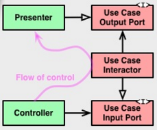

# Clean Architecture

## Pros

1. Independent of frameworks, UI, DB and any external agency
  - Framework를 필요에 따라 활용하는 도구로 활용
  - Business rule에 영향을 주지 않고 UI, DB 변경 가능
1. Testable
  - 외부 시스템(frameworks, UI, DB)과 상관없이 business rule을 테스트 가능

## Dependency rule

- Source code dependency는 안쪽 방향으로만
- 외부 원은 내부 원에 영향을 줄 수 없어야 함
- 내부 원은 외부 원을 몰라야 함

## Layers

### Entities

- Entities can be:
  - Object with methods
  - Set of data structures and functions
- Enterprise (used by different applications)
  - Enterprise wide business rules
- Single Application
  - Most general and high-level rules

### Use Cases

- Application specific business rules
- Encapsulation and implementation of the use cases of the system

### Interface Adapters

- Set of Adapters
  - Convert data format between use cases and external DB, Web, and so forth.

### Frameworks and Drivers

- Composed of frameworks and tools
- Where all the details go
  - Web
  - DB

## Crossing boundaries

Use Case가 인터페이스(Use Case Output Port)를 정의하고 Presenter가 이를 구현하게 함으로써, control flow로 인해 발생하는 Use Case → Presenter dependency를 뒤집음 (Dependency Inversion Principle)

## What data crosses the boundaries

- Data structure의 대해서도 Dependency rule을 지켜야 한다.
- 외부 원에서 사용하는 data structure(e.g. Cursor)를 내부 원에서 사용 금지

## Similar Architectures

- Hexagonal Architecture
- Onion Architecture
- Screaming Architecture
- DCI
- BCE

위의 아키텍처들과 Clean Architecture는 Separation of Concern이라는 목표가 같기 때문에 굉장히 유사하다. 레이어를 사용하여 소프트웨어를 나누었고 적어도 하나의 business rule을 위한 레이어와 interface를 위한 레이어를 포함한다.

## References

- [Clean Architecture - 8th Light ](https://8thlight.com/blog/uncle-bob/2012/08/13/the-clean-architecture.html)
- [googlesamples/android-architecture](https://github.com/googlesamples/android-architecture/tree/todo-mvp-clean)
- [android10/Android-CleanArchitecture](https://github.com/android10/Android-CleanArchitecture)
