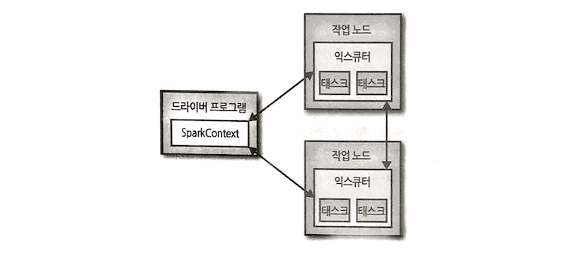

# Learning Spark

## Chapter 1. 스파크를 이용한 데이터 분석 소개

### 스파크?

- **범용적이고 빠른 클러스터용 연산 플랫폼**
- 맵리듀스 모델을 대화형 명령어, 쿼리, 스트리밍 가능하도록 확장한 것
- 속도를 높이기 위해서 연산을 메모리에서 수행
- 고수준 파이썬, 자바, 스칼라, SQL API 내장
- 스칼라로 구현. JVM 위에서 동작.
- 하둡 클러스터 위에서 실행 가능
- 어떤 하둡 호환 데이터 소스에도 접근 가능 (예. HDFS, 로컬 파일 시스템, S3, 카산드라, 하이브, HBase)

### 구성

- 스파크 코어: 작업 스케줄링, 메모리 관리, 장애 복구, 저장장치와 연동 등 기본적인 기능 수행.
- 스파크 SQL: 정형 데이터를 처리하기 위한 스파크 패키지. SQL, 하이브 테이블, 피케이, JSON 등 다양한 데이터 소스 지원.
- 스파크 스트리밍: RDD API와 거의 일치하는 형태의 데이터 스트림 조작 API 지원
- MLlib: 일반적인 머신 러닝 기능 갖고 있는 라이브러리
- 그래프X: 그래프 병렬 연산 수행. 일반적 그래프 알고리즘 지원.
- 클러스터 매니저: 하둡의 얀, 아파치 메소스, 스파크 지원 단독 스케줄러 등 다양한 클러스터 매니저 위에서 동작.

## Chapter 2. 스파크 맛보기

### 다운로드

- `tgz` 파일 [다운로드](http://spark.apache.org/downloads.html) 및 압축해제
- 설치된 하둡 클러스터나 HDFS가 있다면 버전에 맞게 다운로드
- `bin` 디렉토리는 다양한 방식으로 스파크를 사용하기 위한 실행파일 포함
- `examples` 디렉토리는 스파크 API를 공부할 수 있는 간단한 예제코드 포함

### 대화형 셸

- 스파크는 즉석 데이터 분석이 가능한 대화형 셸 제공
- 대화형 셸은 파이썬과 스칼라만 가능

파이썬 셸은 아래와 같이 실행

```bash
bin/pyspark
```

셸을 빠져나가려면 Ctrl + D를 누른다.

IPython을 사용하려면 아래와 같이 실행

```bash
IPYTHON=1 ./bin/pyspark
```

파이썬 셸에서 로컬 파일로부터 RDD(Resilient Distributed Dataset)을 생성해 라인 수를 세는 방법은 아래와 같다.

```python
>>> lines = sc.textFile("../README.md")
>>> lines.count()
99
>>> lines.first()
u'# Apache Spark'
```

### 스파크의 핵심 개념



- 모든 스파크 애플리케이션은 드라이버 프로그램을 포함
- 드라이버 프로그램은 RDD를 정의하고 그 RDD에 연산 작업을 수행한다.
- 드라이버 프로그램들은 `SparkConext` 객체를 통해 스파크에 접속
- 대화형 셸에서는 `SparkContext` 객체는 자동으로 `sc` 변수에 만들어진다.
- 클러스터에서 실행했다면 작업 노드들이 작업 연산을 나누어 처리

많은 스파크 API 들은 클러스터에서 각종 연산 작업을 수행하기 위해 원하는 함수를 인자로 보내는 식으로 동작한다.

```python
>>> lines = sc.textFile("../README.md")
>>> pythonLines = lines.filter(lambda line: "Python" in line)
>>> pythonLines.first()
```

### 단독 애플리케이션

파이썬에서는 `bin/spark-submit`을 이용해 파이썬 스크립트를 실행할 수 있다. `spark-submit`은 스파크가 내장한 파이썬 API가 동작할 수 있는 환경을 설정한다.

```bash
bin/spark-submit my_script.py
```

셸을 사용하는 것과 다르게 `SparkContext` 객체를 직접 초기화해 주어야 한다.

```python
from pyspark import SparkConf, SparkContext

conf = SparkConf().setMaster("local").setAppName("My App")
sc = SparkContext(conf=conf)
```

`SparkConf`를 생성할 때, 클래스터 URL과 애플리케이션 이름을 전달할 수 있다.

스파크를 셧다운하려면 `SparkContext`의 `stop()` 메서드를 호출하거나 그냥 애플리케이션을 끝내면 된다.

## Chapter 3. RDD로 프로그래밍하기

- RDD는 분산되어 존재하는 데이터 요소들의 모임
- 스파크의 모든 작업은 다음 중 하나로 표현
  - RDD 생성
  - RDD 변형
  - RDD에서 연산
- 스파크는 내부적으로 자동으로 RDD에 있는 데이터를 클러스터에 분배하고 클러스터에서 수행하는 연산들을 병렬화

### RDD 기초

- 분산되어 있는 **변경 불가능한** 객체 모음
- 클러스터의 서로 다른 노드에서 연산 가능하도록 여러 개의 파티션으로 구성
- Lazy evaluation 방식으로 RDD를 정의한 시점이 아니라 처음으로 액션을 사용하는 시점에 필요한 데이터만 메모리로 가져와 연산
- 액션을 실행할 때마다 매번 새로 연산
- 여러 액션에서 RDD를 재사용 하려면 `persiste()` 사용하여 결과 유지 요청

```python
pythonLines.persist()
pythonLines.count()
pythonLines.first()
```

#### RDD 생성 방법

1. 외부 데이터세트를 로드 (e.g. `sc.textFile("README.md")`)
1. 드라이버에서 객체 컬렉션을 분산 (e.g. `list`, `set`)

#### RDD 연산 종류

1. 트랜스포메이션: 존재하는 RDD에서 새로운 RDD 만들기 (e.g. `filter()`)
1. 액션: RDD를 기초로 결과 값 계산하여 드라이버 프로그램에 되돌려 주거나 외부 스토리지(e.g. HDFS)에 저장 (e.g. `first()`)

#### 스파크 프로그램 요약


1. 외부 데이터에서 입력 RDD 만들기
1. `filter()`와 같은 트랜스포메이션을 써서 새로운 RDD 정의
1. 재사용을 위한 중간 단계의 RDD를 보존하기 위해 `persist()` 요청
1. 병렬 연산을 수행하기 위해 `count()`, `first()`와 같은 액션을 시작
